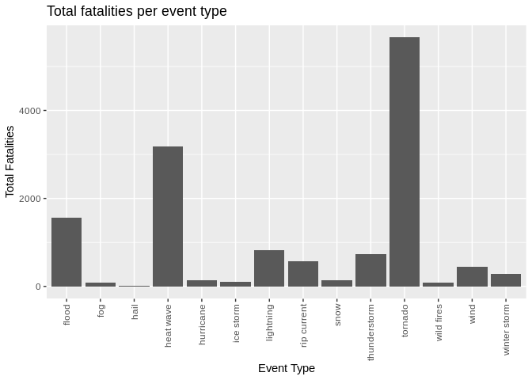
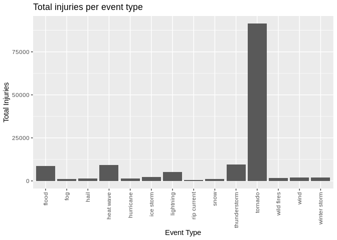

# Synopsis


In this report we aim to describe the impact of severe weather events in the United States between 1950 and 2011 on both population health and the economy. The idea was to provide answers to the following two questions:

- Across the United States, which types of events (as indicated in the EVTYPE\color{red}{\verb|EVTYPE|}EVTYPE variable) are most harmful with respect to population health?
- Across the United States, which types of events have the greatest economic consequences?

## Conclusion

From the storm data, we found that population health is most impacted by tornadoes. These caused the most fatalities and injuries by far.
We also found that the greatest economic impact is from flooding and hurricanes, with lesser impacts from tornadoes and heavy seas.


# Data processing

## Loading and preprocessing the data

First we set up some libraries, unzip the data and load it into R:


```r
suppressPackageStartupMessages({
library(dplyr)
library(knitr)
library(ggplot2)
library(reshape2)
})

SD <- read.csv(bzfile("repdata_data_StormData.csv.bz2"))

dim(SD)
```

```
## [1] 902297     37
```

And some css to make the tables look nice


```css
table {
  margin: auto;
  border-top: 1px solid #666;
  border-bottom: 1px solid #666;
}
table thead th { border-bottom: 1px solid #ddd; }
th, td { padding: 5px; }
thead, tfoot, tr:nth-child(even) { background: #eee; }
```


<style type="text/css">
table {
  margin: auto;
  border-top: 1px solid #666;
  border-bottom: 1px solid #666;
}
table thead th { border-bottom: 1px solid #ddd; }
th, td { padding: 5px; }
thead, tfoot, tr:nth-child(even) { background: #eee; }
</style>

## Clean the event type

The main field we are looking at is EVTYPE (event type), which is a free text field, it is not a standard set of strings. We use a mapping table, contained in [evtype-replacements.csv](https://github.com/matthewfarwell/StormDataAssessment/blob/master/evtype-replacements.csv) to map from the original text to a smaller, more manageable subset of valid event types. In general, the mapping is relatively clear. If the original text contains two possible event types, we take the first. So "rain and wind" becomes "rain". For a complete list of the final event types, see [Event Types](#eventtypes).

For the Event Type, EVTYPE, replace all non-alphanumeric characters by spaces, trim the strings, and replace multiple spaces by one. All of the values are transformed to lower case. The functions *trimtolower* and *csvmapping* are defined in the file [csv_data_mapping.R](https://github.com/matthewfarwell/StormDataAssessment/blob/master/csv_data_mapping.R). If the replacement text is "NA" then the values are replaced by the R value NA (missing indicator).


```r
source("csv_data_mapping.R")
SD$EVTYPE <- trimtolower(SD$EVTYPE)
SD$EVTYPE <- csvmapping(SD$EVTYPE, "evtype-replacements.csv")
```

We create a new data set containing only entries where the EVTYPE column makes sense.


```r
sdWithValidEvtype <- subset(SD, !is.na(SD$EVTYPE))
```

From now on, we will only consider this new data set.

## Calculating the economic damage

The CROPDMGEXP is the exponent of the crop damage. To calculate the damage, we take the value of CROPDMG and multiply it by 10 ^ CROPDMGEXP. Again, though, this is a free text field, with values such as *2*, *5*, *K*, *M* or *B*. In order to calculate the damage, we must replace these with valid numbers where necessary. *K* should be "3", *M* should be "6" and *B* should be 9. The full mapping is contained in [cropdmgexp-replacements.csv](https://github.com/matthewfarwell/StormDataAssessment/blob/master/cropdmgexp-replacements.csv).

We treat PROPDMGEXP similarly, using [propdmgexp-replacements.csv](https://github.com/matthewfarwell/StormDataAssessment/blob/master/propdmgexp-replacements.csv).


```r
sdWithValidEvtype$CROPDMGEXP <- trimtolower(sdWithValidEvtype$CROPDMGEXP)
sdWithValidEvtype$CROPDMGEXP <- csvmapping(sdWithValidEvtype$CROPDMGEXP, "cropdmgexp-replacements.csv")

sdWithValidEvtype$PROPDMGEXP <- trimtolower(sdWithValidEvtype$PROPDMGEXP)
sdWithValidEvtype$PROPDMGEXP <- csvmapping(sdWithValidEvtype$PROPDMGEXP, "propdmgexp-replacements.csv")
```

Finally, for the data cleaning, we replace any missing values with 0 for the FATALITIES, INJURIES, PROPDMGEXP, PROPDMG, CROPDMGEXP, CROPDMG. This is so that they have no impact on later calculations.


```r
sdWithValidEvtype$FATALITIES <- replaceNa(sdWithValidEvtype$FATALITIES, 0)
sdWithValidEvtype$INJURIES <- replaceNa(sdWithValidEvtype$INJURIES, 0)

sdWithValidEvtype$PROPDMGEXP <- replaceNa(sdWithValidEvtype$PROPDMGEXP, 0)
sdWithValidEvtype$PROPDMG <- replaceNa(sdWithValidEvtype$PROPDMG, 0)

sdWithValidEvtype$CROPDMGEXP <- replaceNa(sdWithValidEvtype$CROPDMGEXP, 0)
sdWithValidEvtype$CROPDMG <- replaceNa(sdWithValidEvtype$CROPDMG, 0)
```

# Results

## <a name="eventtypes"></a>Event types

From the data cleaning, we are left with the following event types:


```r
kd <- data.frame(Event.Type=sort(unique(sdWithValidEvtype$EVTYPE)))
kd2 <- cbind(kd[1:8, ], kd[9:16, ], kd[17:24, ], kd[25:32, ], kd[33:40, ], kd[41:48, ])

kable(kd2, caption = "Event Types", col.names=rep("", 6))
```


Table: Event Types

|                |                 |                |                |               |             |
|:---------------|:----------------|:---------------|:---------------|:--------------|:------------|
|avalanche       |dust storm       |heavy seas      |low tide        |sleet          |tsunami      |
|blizzard        |flood            |high tide       |marine accident |smoke          |typhoon      |
|blow out tide   |fog              |high water      |microburst      |snow           |volcanic ash |
|coastal erosion |freezing weather |hurricane       |mud slide       |storm          |water spout  |
|dam failure     |frost            |ice storm       |rain            |thundersnow    |wild fires   |
|downburst       |gustnado         |landslide       |rip current     |thunderstorm   |wind         |
|drowning        |hail             |lightning       |rock slide      |tornado        |wind chill   |
|dry conditions  |heat wave        |low temperature |saharan dust    |tropical storm |winter storm |

## Effects on population health of weather events

Here, we count only the number of fatalities and injuries which are caused by the weather events.
We total the number of fatalities and injuries for each event type. To keep the tables manageable, we are only looking at event types
where the total number of fatalities is greater than or equal to 500 or the number of injuries is greater than or equal to 1000.


```r
fatalitiesPerEvtype <- sdWithValidEvtype %>%
                       group_by(EVTYPE) %>%
                       summarise(fatalities = sum(FATALITIES), injuries = sum(INJURIES), .groups='keep') %>%
                       filter(fatalities >= 500 | injuries >= 1000) %>%
                       arrange(desc(fatalities), desc(injuries), EVTYPE)
```

This gives us the following event types, in descending order of the number of fatalities,


```r
kable(caption = "Event Types with the most fatalities or injuries", col.names=c("Event Type", "Fatalities", "Injuries"), fatalitiesPerEvtype)
```


Table: Event Types with the most fatalities or injuries

|Event Type   | Fatalities| Injuries|
|:------------|----------:|--------:|
|tornado      |       5659|    91367|
|heat wave    |       3176|     9243|
|flood        |       1554|     8681|
|lightning    |        817|     5232|
|thunderstorm |        730|     9542|
|rip current  |        577|      529|
|wind         |        449|     1895|
|winter storm |        279|     1968|
|snow         |        146|     1156|
|hurricane    |        135|     1328|
|ice storm    |        108|     2377|
|wild fires   |         90|     1608|
|fog          |         81|     1077|
|hail         |         15|     1371|

As you can see, some event types have much more impact than others. Here is the above table as two bar charts, one for fatalities and one for injuries:


```r
melted <- melt(fatalitiesPerEvtype, id.vars = "EVTYPE")

ggplot(melted %>% filter(variable=="fatalities"), aes(EVTYPE, value)) +
    geom_bar(stat = "identity") +
    theme(axis.text.x = element_text(angle = 90, vjust = 0.5, hjust=1)) +
    ggtitle("Total fatalities per event type") + xlab("Event Type") + ylab("Total Fatalities")
```

<!-- -->

```r
ggplot(melted %>% filter(variable == "injuries"), aes(EVTYPE, value)) +
    geom_bar(stat = "identity") +
    theme(axis.text.x = element_text(angle = 90, vjust = 0.5, hjust=1)) +
    ggtitle("Total injuries per event type") + xlab("Event Type") + ylab("Total Injuries")
```

<!-- -->

We can see from these graphs that the impact of **tornados** is much greater than the other event types, both in terms of fatalities and injuries. In terms of fatalities, only **heat wave** and **flood** come close.

# Economic effects of weather events

We can apply a similar process for studying the economic damage for the weather events. We start with the same reduced event types. We calculate the total damage by adding the the property damage (PROPDMG * 10 ^ PROPDMGEXP) and adding it to the crop damage (CROPDMG * 10 ^ CROPDMGEXP). We include only the event types which have caused over 10 billion dollars worth of damage, in total.


```r
dmgPerEvtype <- sdWithValidEvtype %>%
                mutate(calcDmg = PROPDMG*(10**as.numeric(PROPDMGEXP)) + CROPDMG*(10**as.numeric(CROPDMGEXP))) %>%
                group_by(EVTYPE) %>%
                summarise(dmg = sum(calcDmg), .groups='keep') %>%
                filter(dmg >= 10000000000) %>%
                arrange(desc(dmg), EVTYPE)
```

This gives us the following event types, in descending order of the economic impact:


```r
kable(dmgPerEvtype, caption = "Event Types with the most economic impact", format.args=list(big.mark = ","), col.names=c("Event Type", "Impact ($)"))
```


Table: Event Types with the most economic impact

|Event Type     |      Impact ($)|
|:--------------|---------------:|
|flood          | 180,636,835,735|
|hurricane      |  90,271,472,810|
|tornado        |  58,969,827,546|
|heavy seas     |  48,068,119,500|
|hail           |  19,024,431,636|
|dry conditions |  15,018,677,780|
|thunderstorm   |  12,456,660,688|

From this table, you can see that the most economic impact comes from **flood**, which is about double the next, **hurricane**. **tornado** and **heavy seas** are the next highest.


# Limitations of the analysis

- No adjustment for inflation of the economic data has been done. Therefore, later events will have a bigger impact than earlier.
- As mentioned above, the categorisation of the event type is subjective. A finer grained analysis could be performed. However, changing the categorisation would not have a high impact of the conclusions of the analysis.
- A different analysis could have multiple categories, for each line in the CSV, so "rain and wind" could be categorised as both rain and wind. However, this would make the rest of the analysis more difficult. How would the cost be split between the two categories? Even more difficult would be to split the fatalities and injuries

# Other information


```r
sessionInfo()
```

```
## R version 4.0.2 (2020-06-22)
## Platform: x86_64-pc-linux-gnu (64-bit)
## Running under: Ubuntu 18.04.4 LTS
## 
## Matrix products: default
## BLAS:   /usr/lib/x86_64-linux-gnu/blas/libblas.so.3.7.1
## LAPACK: /usr/lib/x86_64-linux-gnu/lapack/liblapack.so.3.7.1
## 
## locale:
##  [1] LC_CTYPE=en_US.UTF-8       LC_NUMERIC=C              
##  [3] LC_TIME=en_US.UTF-8        LC_COLLATE=en_US.UTF-8    
##  [5] LC_MONETARY=en_US.UTF-8    LC_MESSAGES=en_US.UTF-8   
##  [7] LC_PAPER=en_US.UTF-8       LC_NAME=C                 
##  [9] LC_ADDRESS=C               LC_TELEPHONE=C            
## [11] LC_MEASUREMENT=en_US.UTF-8 LC_IDENTIFICATION=C       
## 
## attached base packages:
## [1] stats     graphics  grDevices utils     datasets  methods   base     
## 
## other attached packages:
## [1] reshape2_1.4.4 ggplot2_3.3.2  knitr_1.29     dplyr_1.0.0   
## 
## loaded via a namespace (and not attached):
##  [1] Rcpp_1.0.5       magrittr_1.5     munsell_0.5.0    tidyselect_1.1.0
##  [5] colorspace_1.4-1 R6_2.4.1         rlang_0.4.7      highr_0.8       
##  [9] plyr_1.8.6       stringr_1.4.0    tools_4.0.2      grid_4.0.2      
## [13] gtable_0.3.0     xfun_0.15        withr_2.2.0      htmltools_0.5.0 
## [17] ellipsis_0.3.1   yaml_2.2.1       digest_0.6.25    tibble_3.0.3    
## [21] lifecycle_0.2.0  crayon_1.3.4     farver_2.0.3     purrr_0.3.4     
## [25] vctrs_0.3.2      glue_1.4.1       evaluate_0.14    rmarkdown_2.3   
## [29] labeling_0.3     stringi_1.4.6    compiler_4.0.2   pillar_1.4.6    
## [33] generics_0.0.2   scales_1.1.1     pkgconfig_2.0.3
```

The data for this analysis comes from:  in the form of a comma-separated-value file compressed via the bzip2 algorithm to reduce its size. You can download the file from the course web site: [Storm Data](https://d396qusza40orc.cloudfront.net/repdata%2Fdata%2FStormData.csv.bz2)

There is also some documentation of the database available.

- National Weather Service [Storm Data Documentation](https://d396qusza40orc.cloudfront.net/repdata%2Fpeer2_doc%2Fpd01016005curr.pdf)
- National Climatic Data Center Storm Events [FAQ](https://d396qusza40orc.cloudfront.net/repdata%2Fpeer2_doc%2FNCDC%20Storm%20Events-FAQ%20Page.pdf)

The code is available on [Github](https://github.com/matthewfarwell/StormDataAssessment).
